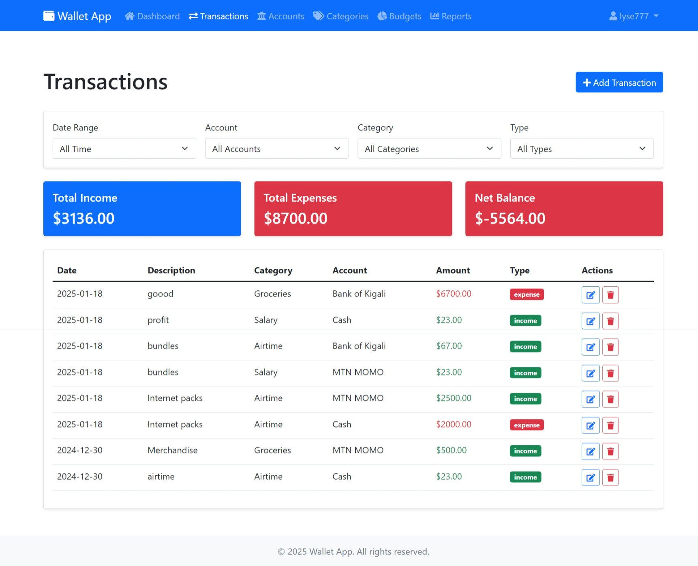

# Wallet Web Application

A comprehensive web-based solution for tracking personal finances, managing multiple accounts, and monitoring expenses across different categories. This application helps users maintain better control over their financial activities by providing detailed insights and reports.

Live Demo: https://taskforce-n9sg.onrender.com

## Features and Functionalities

1. **User Authentication**
   - Secure registration and login system
   - Password hashing for enhanced security
   - Session management

2. **Account Management**
   - Create and manage multiple accounts (bank accounts, mobile money, cash, etc.)
   - Track real-time balance for each account
   - View account-specific transaction history

3. **Transaction Tracking**
   - Record income and expenses
   - Detailed transaction history with date, description, and category
   - Filter transactions by date, account, or category
   - Search functionality for finding specific transactions

4. **Category Management**
   - Create custom categories and subcategories
   - Organize expenses by categories
   - Link transactions to specific categories
   - Hierarchical category structure

5. **Budgeting System**
   - Set budget limits for different categories
   - Real-time budget tracking
   - Automated notifications when approaching or exceeding budget limits
   - Visual representation of budget utilization

6. **Reporting and Analytics**
   - Generate detailed financial reports
   - Customizable date ranges for reports
   - Export reports in PDF format
   - Visual data representation through charts and graphs
   - Income vs. Expenses analysis
   - Category-wise expense breakdown

7. **Dashboard**
   - Overview of total balance across all accounts
   - Recent transaction summary
   - Monthly income and expense trends
   - Budget alerts and notifications
   - Visual representations of financial data

## Prerequisites

Before setting up the project, ensure you have the following installed:

- Python 3.8 or higher
- pip (Python package manager)
- SQLite3
- Git

## Project Setup

1. **Clone the Repository**
   ```bash
   git clone https://github.com/Lyse777/Taskforce.git
   cd wallet-app
   ```

2. **Create Virtual Environment**
   ```bash
   python -m venv venv
   ```

3. **Activate Virtual Environment**
   - For Windows:
     ```bash
     venv\Scripts\activate
     ```
   - For macOS/Linux:
     ```bash
     source venv/bin/activate
     ```

4. **Install Dependencies**
   ```bash
   pip install -r requirements.txt
   ```

5. **Initialize Database**
   ```bash
   flask db init
   flask db migrate
   flask db upgrade
   ```

6. **Run the Application**
   ```bash
   python app.py
   ```

The application will be available at `http://localhost:5000`

## Deployment

The application is currently deployed on Render and can be accessed at [https://taskforce-n9sg.onrender.com](https://taskforce-n9sg.onrender.com)

To deploy your own instance:
1. Create an account on Render
2. Connect your GitHub repository
3. Create a new Web Service
4. Configure the build and start commands
5. Set up environment variables if necessary

## Application Screenshots

### 1. Register Interface

A clean registration interface where new users can create their accounts with username and secure password.

### 2. Login Interface

Secure login page with username/password authentication and "Remember me" functionality.

### 3. Dashboard Overview

Main dashboard displaying total balance, monthly summaries, income vs expenses chart, recent transactions, and budget alerts.

### 4. Accounts Management

Comprehensive view of all financial accounts with balances and transaction counts.

### 5. Budget Management

Budget tracking interface with visual representations of spending limits and current progress.

### 6. Expense Categories

Expense category management with main categories and subcategories for expense tracking.

### 7. Income Categories

Income category management for organizing different sources of income.

### 8. Transactions List

Detailed transaction history with filtering options and transaction management tools.

### 9. Reports Interface

Customizable financial reporting interface with various filtering options.

### 10. PDF Report View

Generated PDF report showing financial summaries and transaction details.

### 11. Logout Option

Secure logout functionality accessible from any page.
